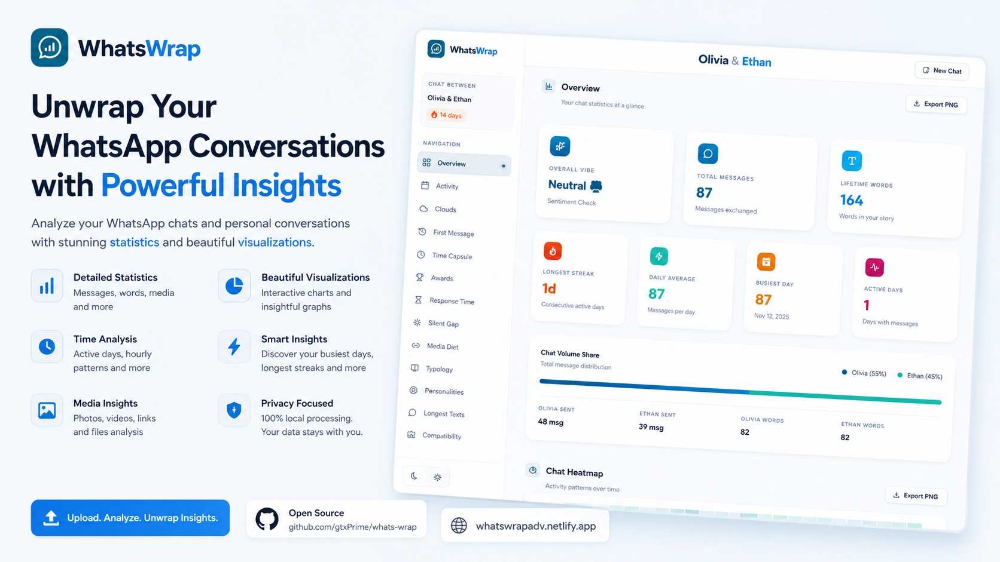

# 💬 WhatsWrap

<p align="center">
  
</p>

<p align="center">
  <a href="https://whatsupwrap.netlify.app/" target="_blank">
    
  </a>
  <a href="https://whatswrapadv.netlify.app/" target="_blank">
    
  </a>
  
  
  
</p>

**WhatsWrap** is a gorgeous, premium, and interactive browser-based dashboard that transforms your exported WhatsApp chat logs into a highly visual, personalized, and private year-in-recap review (similar to Spotify Wrapped). 

> 🌐 **Live Demo:** Try it out live at **[whatsupwrap.netlify.app](https://whatsupwrap.netlify.app/)** · Backup Link: **[whatswrapadv.netlify.app](https://whatswrapadv.netlify.app/)**

It is a **100% client-side** application, meaning that all chat parsing, logic calculations, and rendering occur entirely in your local browser window. **Your chat files are never uploaded or transmitted to any server**, keeping your conversations fully private and secure.

## ✨ Features

- 📈 **Interactive Metric Grids**: View high-level stats like total message volume, word counts, character frequencies, media files sent, deleted messages, and web hyperlinks shared.
- 📅 **Chat Streaks Tracker**: Computes your longest running day-to-day conversation streak and reveals your busiest, highest-volume messaging dates.
- 🕒 **Time Capsule Cards**: Month-by-month breakdowns highlighting key chat phases, active user patterns, monthly mascots, and conversational shifts.
- 🌪️ **Alternate Universe Awards**: Fun, logic-derived category crowns including *CEO of Double Texting*, *Minister of Chaos* (burst texting cascades), *Emoji Economist*, *Meme Lord*, and *Certified Yapper*.
- ⚡ **Personality Profiles**: Dynamically assigns custom roles (such as *The Night Owl*, *The Novelist*, *The Reactor*, or *The Speed Typer*) based on text length, time of day, and typing velocity.
- 💝 **Compatibility Sync**: Measures reply response correlation, emoji style matches, overlap times, and overall conversation balance.
- ⏱️ **The Waiting Game**: Calculates average reply speeds to identify the 'Speed Demon' versus the one who takes their time.
- 🔗 **The Media Diet**: Scans URLs to aggregate and visualize the top websites/apps shared between chatters.
- 🤐 **The Silent Treatment**: Discovers the absolute longest gap went without talking in the entire chat history.
- 📏 **Texter Typology**: Breaks down messaging styles into buckets from "One-Worder" to "The Novel".
- 📸 **Smart PDF Engine**: An intelligent multi-page A4 PDF exporter that mathematically calculates page breaks to ensure no cards or charts are ever cut in half.

## 🚀 Getting Started

### Prerequisites

You only need **Node.js** (v18+) and **npm** installed on your computer.

### Installation & Run

1. Clone this repository:
   ```bash
   git clone https://github.com/gtxPrime/whats-wrap.git
   cd whats-wrap
   ```

2. Install dependencies:
   ```bash
   npm install
   ```

3. Start the Vite local development server:
   ```bash
   npm run dev
   ```

4. Open your browser and navigate to the local address displayed in your terminal (usually `http://localhost:5173/`).

## 🛠️ Tech Stack & Design

- **Core Framework**: React (with state-driven responsive architectures).
- **Tooling**: Vite.
- **Styling**: Pure CSS3 variables with high-end glassmorphism, responsive flex grids, custom radial glow effects, and modern fluid typography.
- **Asset Parsing**: JSZip (for reading compressed WhatsApp chat outputs directly).

## 🔒 Privacy & Security

WhatsWrap takes user privacy extremely seriously. 

- All calculations are processed locally on the client's device using standard JavaScript FileReaders.
- No network requests are made, and no backend interfaces are connected.
- Your personal messages, emojis, files, and participants remain exclusively on your computer.

## 📝 License

This project is licensed under the [MIT License](LICENSE). Made with ❤️ by [gtxPrime](https://github.com/gtxPrime).
